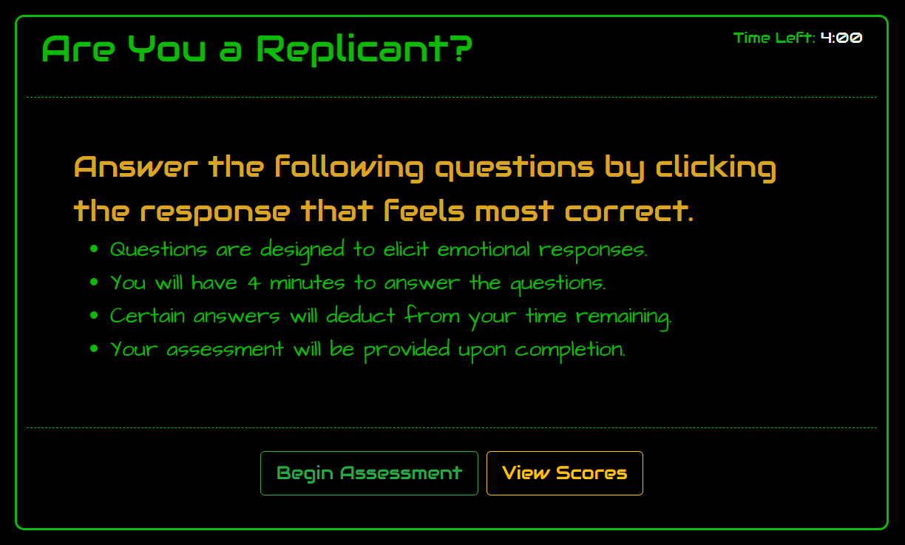
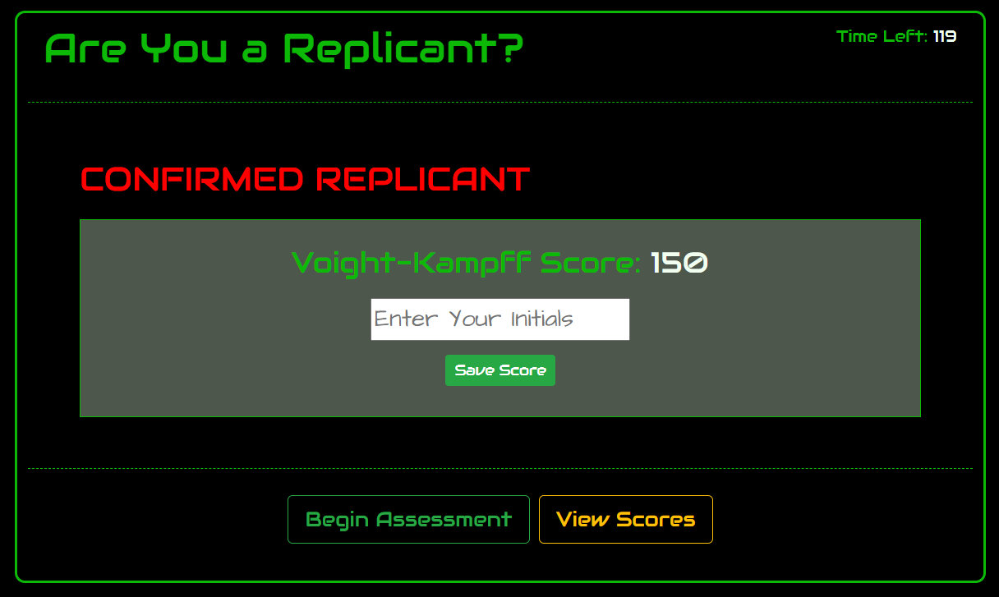
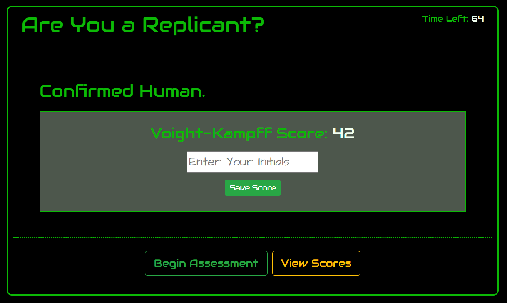
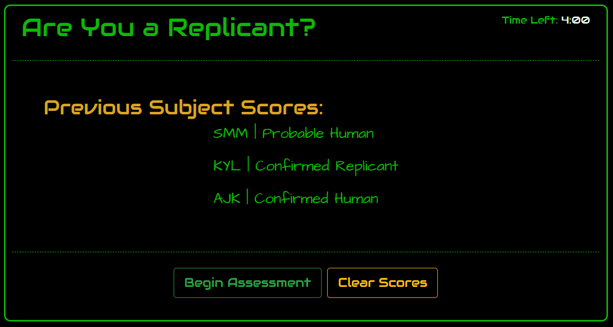

# JavaScript Quiz: Are You a Replicant?

## Description

"Are You a Replicant?" is a timed quiz built with classic JavaScript, CSS, and HTML.  Designed as a variation of the ever popular [quirky personality quiz](https://www.pinterest.com/roxygirl35/quirky-quizzes/) a la _BuzzFeed_, this quiz pays homage to the [Voight-Kampff](https://nautil.us/blog/the-science-behind-blade-runners-voight_kampff-test)  test from the _Blade Runner_ franchise.

------------------
## Deployed Application

View the [deployed application](https://seagda.github.io/code-quiz/).

------------------
## Functionality
Instructions are presented on the start screen. 

Once the user clicks "Begin Assessment", the timer starts, and questions are displayed and formatted by toggling between **style.display** and **style.color** values.  

Users answer a pre-defined set of questions whose answers and score values are stored in nested objects. Possible answers are displayed, and user score is calculated based the option selected.

If the user scores: 
* 140 or greater, they are assessed as "Confirmed Replicant."
* between 100 and 139, they are assessed as "Possible Replicant."
* between 50 and 99, they are assessed as "Probable Human."
* less than 50, they are assessed as "Confirmed Human."

Scores are saved to localStorage, and saved scores are accessed when the user clicks the "Show Scores" button. 

------------------
## Dependencies

* [Bootstrap](https://getbootstrap.com/)
* [Google Fonts API](https://developers.google.com/fonts/docs/getting_started)
* [Luxon](https://moment.github.io/luxon/index.html)

------------------
## Application Requirements

AS a user, I WANT to take a fun personality quiz SO THAT:

* WHEN I click a start button,
a timer starts and I am presented with a question.
* WHEN I answer that question,
I am presented with another question.
* WHEN I select answers with point value of 0,
time is subtracted from the clock.
* WHEN all questions are answered or the timer reaches 0,
the game is over.
* WHEN the game is over,
I can save my initials and scores.
* WHEN my score is saved,
I can view it within a list of previous scores.
